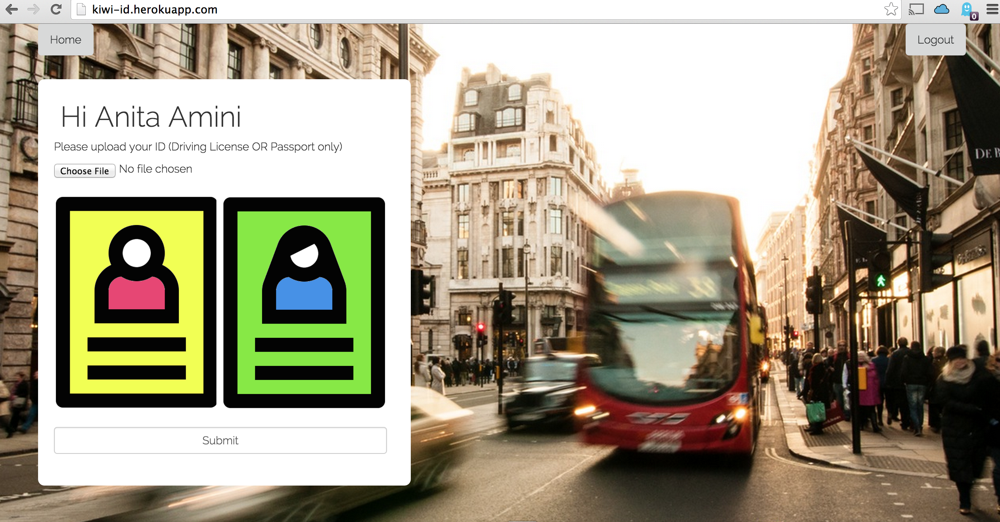
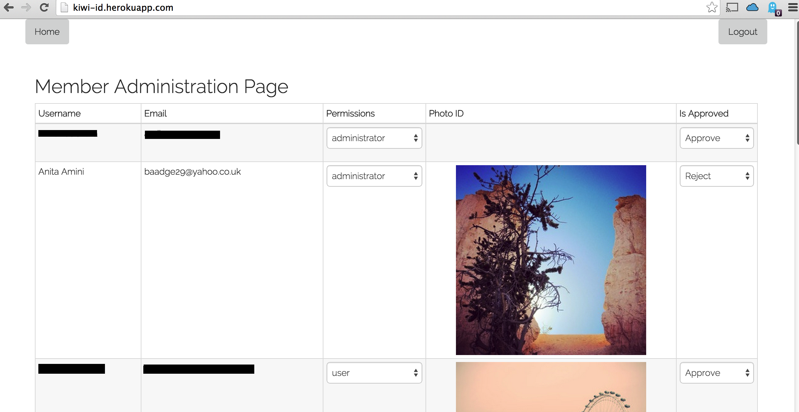

###Photo ID App

A single page application for students to upload their photo ID and use at drinking establishments as proof of age. This would avoid potential loss of driving licenses/passports which is a common occurance among the target group. 

####Upload Page

####Profile Page

####Admin Page

###Technology Stack
- Hapi.js (Node.js Framework)
- MongoDB
- Amazon S3
- Jade (Templating Language)
- Bootstrap
- Facebook Authentication

###Links
- [Github Repository](https://github.com/IDThieves/i-am-old-enough-honest)
- [URL](http://kiwi-id.herokuapp.com/)