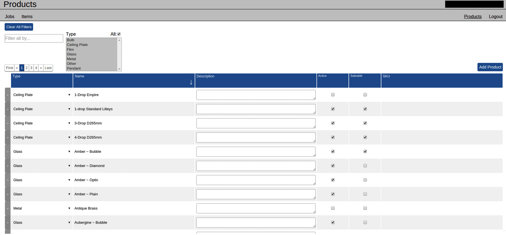
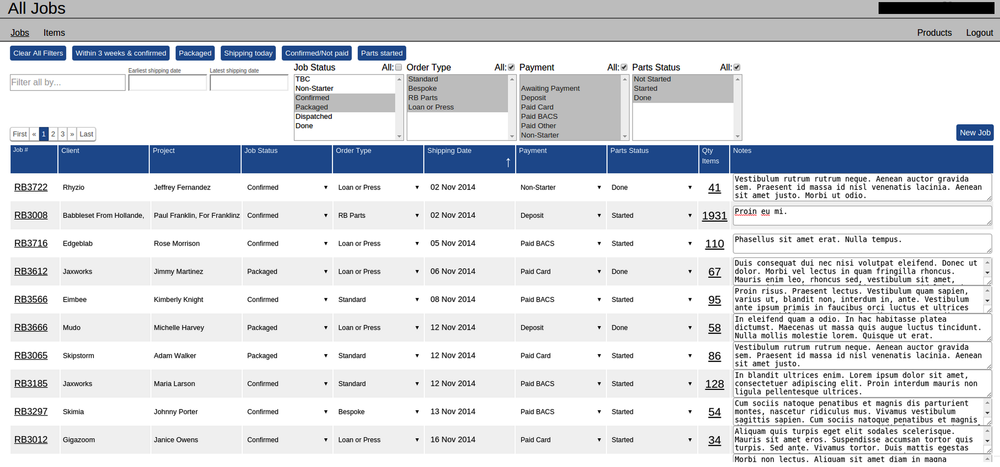
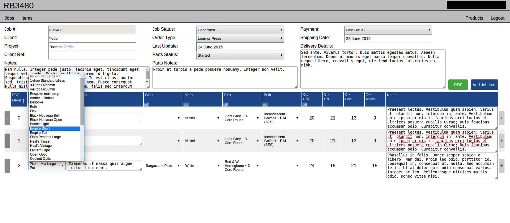
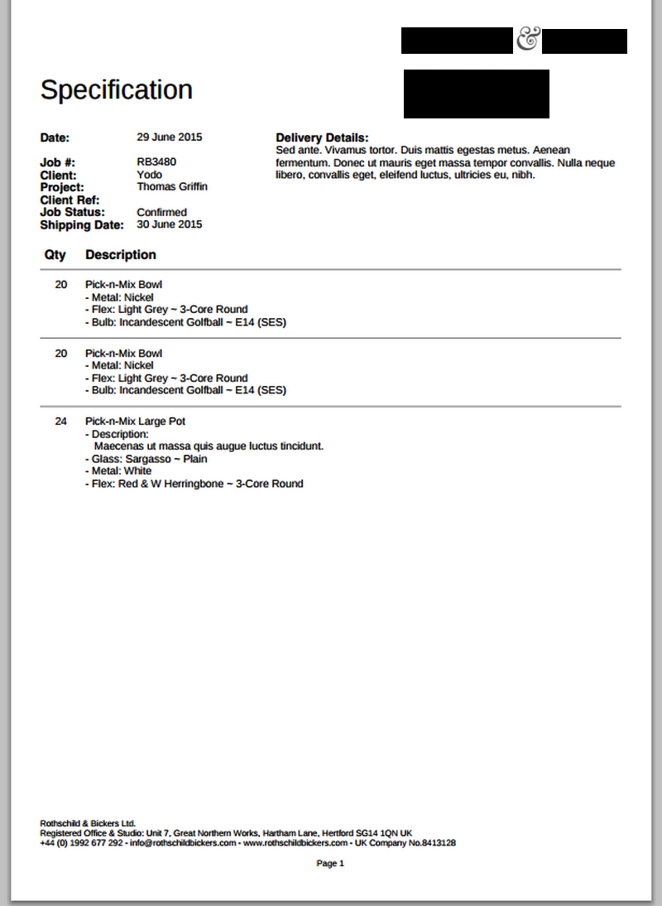

###A Productivity App for Managing Data

The application is for a business that offers bespoke supplies. They have thousands of records and many job items within a single order. I was reponsible for developing the challenging relational database logic between tables, as well as other backend functionalites.

####Products Table

####All Jobs Table

####Job Items Table

####PDF Generation

####Technology Stack

- React.js
- PostgreSQL
- Hapi.js

####Links
- [Github Repository](https://github.com/foundersandcoders/chandelier)
- The URL is only available to the client