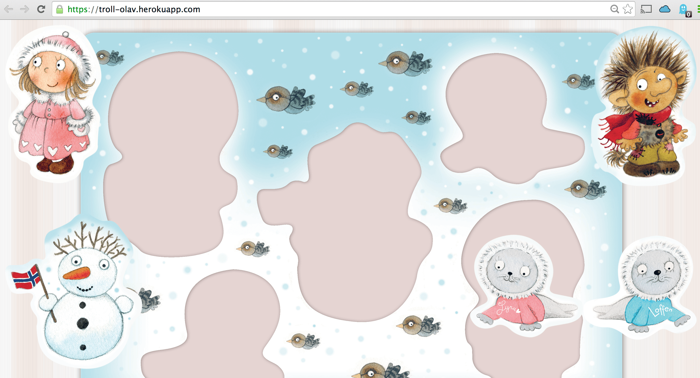

###Puzzle App for Toddlers

The client was a children's book in Norway. She requested this small project for kids to engage in the books and have fun playing this little game. She was very happy with outcome.

I was involved with the frontend and UI.

###Technology Stack
- React.js
- Bootstrap
- Hapi.js

###Links

- [Github Repository](https://github.com/Troll-Olav/Puzzle)
- [URL](https://troll-olav.herokuapp.com/)
